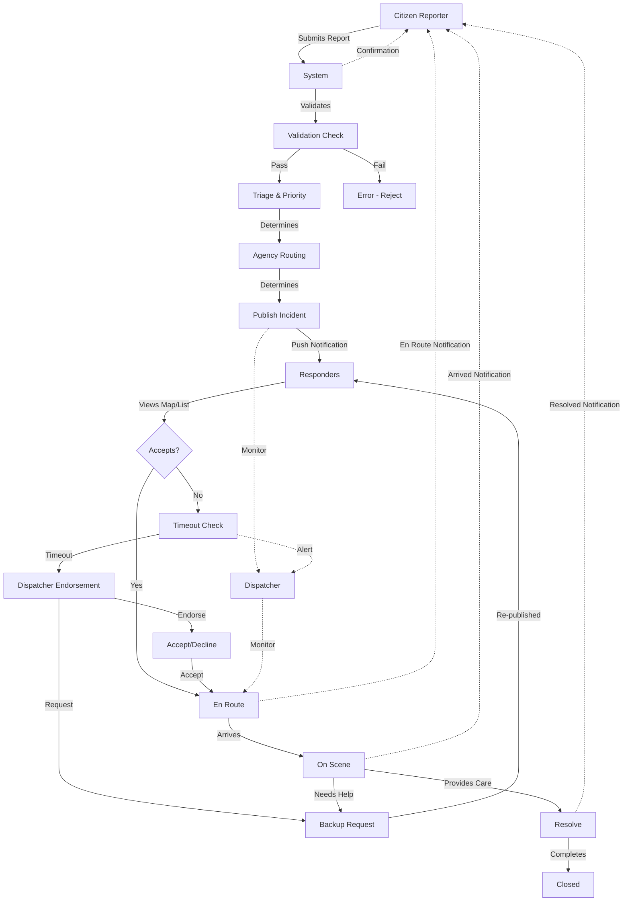
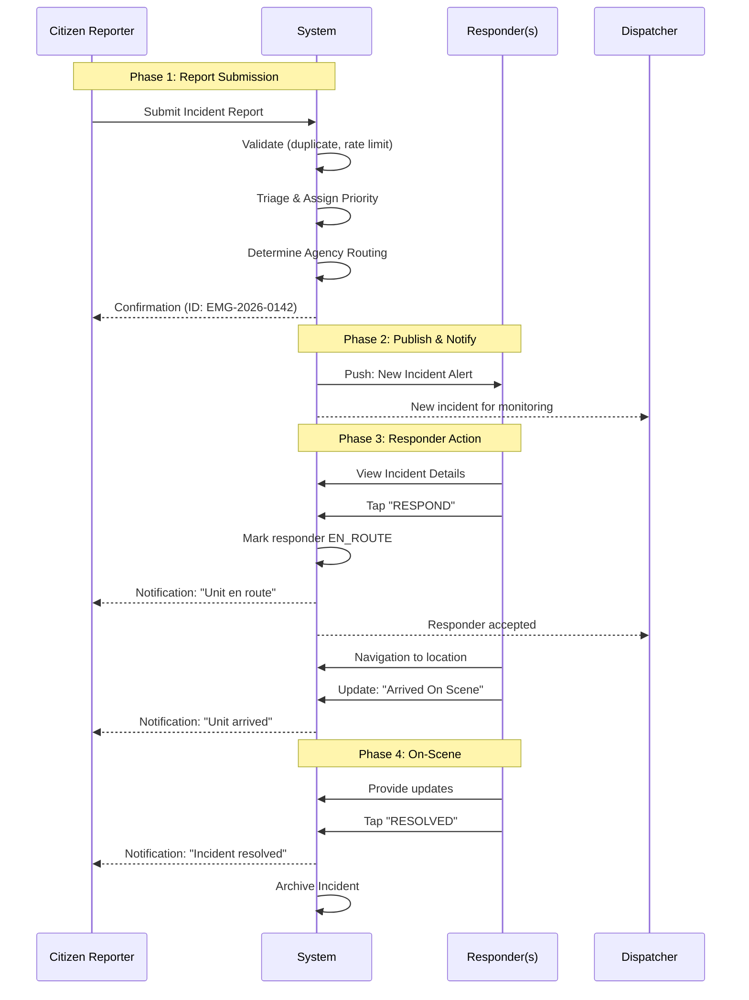
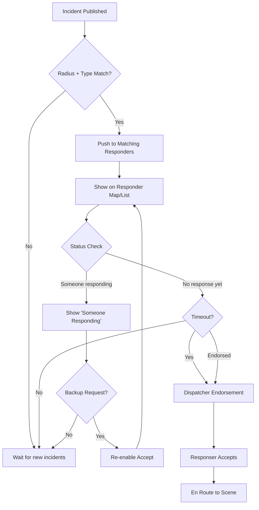
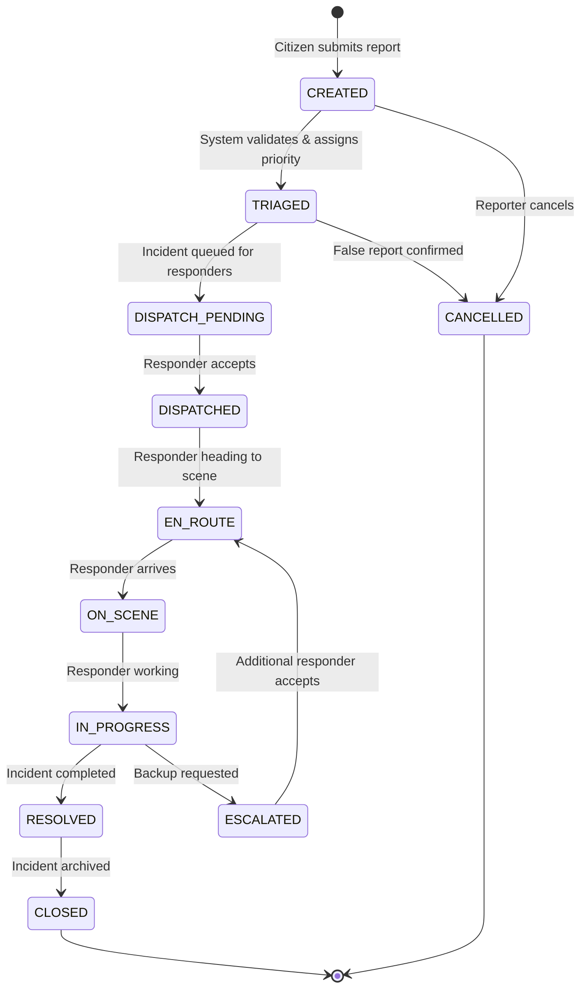
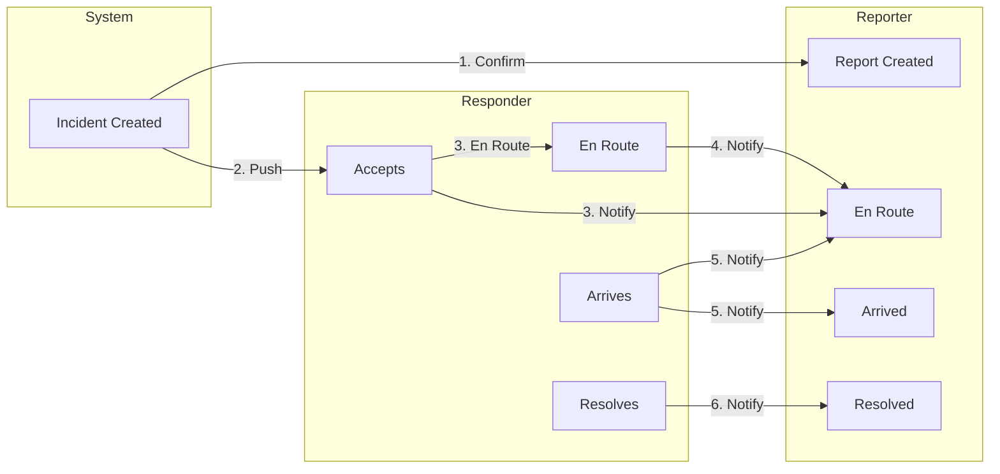
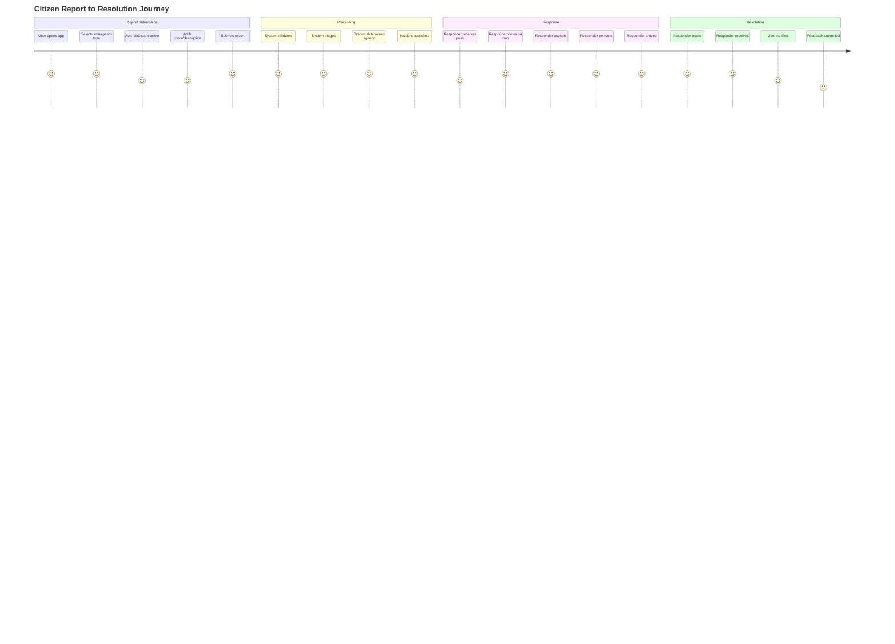
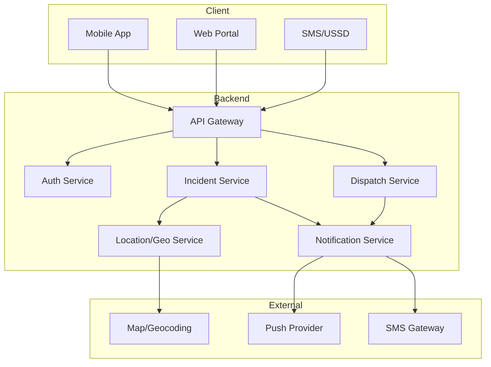

# Citizen Reporting Incident Workflow - Detailed Design

**Document Title:** Citizen Reporting to Incident Resolution Workflow
**Version:** 1.0
**Date:** 2026-03-26
**Author:** Jan Dave Zamora
**Status:** Draft
**Related Documents:**
- user-journey-maps.md
- api-specification.md
- technical-architecture.md

---

## 1. Overview

This document provides a comprehensive workflow specification for the emergency response platform, covering the complete lifecycle from citizen incident report submission through incident resolution. The workflow encompasses all actors: Citizen Reporters, Responders (Police, Fire, Ambulance), Dispatchers, and System Monitors.

### 1.1 Scope

- **Incident Types:** Medical, Fire, Police, Traffic, Disaster
- **Actors:** Citizen Reporter, First Aider, Responder (Police/Fire/Ambulance), Dispatcher, System Monitor
- **Channels:** Mobile App, SMS, USSD, Web

### 1.2 High-Level Workflow Summary

```
┌─────────────────────────────────────────────────────────────────────────────────────┐
│                    CITIZEN REPORTING TO RESOLUTION FLOW                          │
└─────────────────────────────────────────────────────────────────────────────────────┘

  ┌──────────┐    ┌──────────┐    ┌──────────┐    ┌──────────┐    ┌──────────┐
  │ CITIZEN  │───▶│ SYSTEM   │───▶│ DISPATCH │───▶│RESPONDER │───▶│ SYSTEM   │
  │ REPORTS  │    │ RECEIVES │    │ LOGIC    │    │ RESPONDS │    │ RESOLVES │
  └──────────┘    └──────────┘    └──────────┘    └──────────┘    └──────────┘
       │               │                  │                │                │
       │               │                  │                │                │
       ▼               ▼                  ▼                ▼                ▼
  ┌──────────┐    ┌──────────┐    ┌──────────┐    ┌──────────┐    ┌──────────┐
  │ • Type    │    │ • Create │    │ • Auto    │    │ • Accept │    │ • Status │
  │ • Location│    │ • Validate│   │   dispatch│   │ • En     │    │   UPDATE │
  │ • Photo   │    │ • Triage  │    │ • Escalate│   │   route  │    │ • Close  │
  │ • Voice   │    │ • Route   │    │ • Monitor │   │ • On     │    │ • Archive│
  └──────────┘    └──────────┘    └──────────┘    └──────────┘    └──────────┘
                                              │
                                              ▼
                                        ┌──────────┐
                                        │ DISPATCH │
                                        │ MONITORS │
                                        └──────────┘
```

---

## 1.3 Process Flowchart



---

## 1.4 Sequence Diagram



---

## 1.5 Responder Dispatch Flow



---

## 2. Incident State Machine

### 2.1 States Definition

| State | Description | Actor | Next State |
|-------|-------------|-------|------------|
| CREATED | Incident created by citizen, awaiting triage | System | TRIAGED |
| TRIAGED | Incident categorized and prioritized | System | DISPATCH_PENDING |
| DISPATCH_PENDING | Awaiting responder assignment | System | DISPATCHED |
| DISPATCHED | Responder(s) assigned and notified | System/Dispatcher | EN_ROUTE |
| EN_ROUTE | Responder traveling to incident location | Responder | ON_SCENE |
| ON_SCENE | Responder arrived at incident location | Responder | IN_PROGRESS |
| IN_PROGRESS | Responder working on incident | Responder | RESOLVED / ESCALATED |
| ESCALATED | Incident escalated to additional agencies | System/Dispatcher | EN_ROUTE |
| RESOLVED | Incident resolved | Responder | CLOSED |
| CANCELLED | Incident cancelled (false report/resolved) | Reporter/Dispatcher | TERMINAL |
| CLOSED | Incident archived | System | TERMINAL |

### 2.2 State Transition Diagram

```
                    ┌─────────────────────────────────────────┐
                    │                                         │
                    ▼                                         │
              ┌──────────┐                                     │
         ┌────│ CREATED  │────┐                                │
         │    └──────────┘    │                                │
         │         │           │                                │
         │         ▼           │                                │
         │    ┌──────────┐      │                                │
         │    │ TRIAGED  │◀─────┤                                │
         │    └──────────┘      │                                │
         │         │           │                                │
         │         ▼           │                                │
         │ ┌────────────────┐  │         ┌────────────────┐     │
         │ │DISPATCH_PENDING│──┼────────▶│   DISPATCHED   │     │
         │ └────────────────┘  │         └────────┬───────┘     │
         │         │           │                  │             │
         │         │           │                  ▼             │
         │         │           │         ┌──────────────┐       │
         │         │           │    ┌────│   EN_ROUTE   │       │
         │         │           │    │    └──────────────┘       │
         │         │           │    │           │               │
         │         │           │    │           ▼               │
         │         │           │    │    ┌──────────────┐       │
         │         │           │    └────│   ON_SCENE   │       │
         │         │           │         └──────────────┘       │
         │         │           │                │                │
         │         │           │                ▼                │
         │         │           │         ┌──────────────┐       │
         │         │           │    ┌────│  IN_PROGRESS  │────┐  │
         │         │           │    │    └──────────────┘    │  │
         │         │           │    │           │            │  │
         │         │           │    │           ▼            │  │
         │         │           │    │    ┌──────────────┐    │  │
         │         │           │    │    │   ESCALATED  │────┘  │
         │         │           │    │    └──────────────┘       │
         │         │           │    │           │               │
         │         │           │    │           ▼               │
         │         │           │    │    ┌──────────────┐       │
         │         ▼           │    └────│   RESOLVED    │       │
         │    ┌──────────┐      │         └──────┬───────┘       │
         └───▶│ CANCELLED │◀─────┘                │               │
              └──────────┘                        ▼               │
                    ▲                      ┌──────────┐          │
                    │                      │  CLOSED  │◀─────────┘
                    └──────────────────────└──────────┘
```

### 2.2 State Machine (Mermaid)



### 2.3 Priority Levels

| Priority | Description | SLA Response Time | Example |
|----------|-------------|-------------------|---------|
| CRITICAL | Life-threatening, mass casualty | < 3 minutes | Cardiac arrest, active shooter |
| HIGH | Serious incident requiring urgent response | < 5 minutes | Accident with injuries, structure fire |
| MEDIUM | Moderate incident | < 10 minutes | Non-injury accident, small fire |
| LOW | Minor incident | < 30 minutes | Traffic obstruction, noise complaint |

---

## 3. Phase 1: Citizen Reporting

### 3.1 Reporting Channels

The platform supports multiple channels for citizens to report emergencies:

1. **Mobile App** - Primary channel with full features
2. **SMS** - Fallback for feature phones
3. **USSD** - Low-bandwidth fallback
4. **Web** - Desktop/laptop reporting
5. **Voice Call (Future)** - IVR-based reporting

### 3.2 Mobile App Reporting Flow

```
┌─────────────────────────────────────────────────────────────────────────────────┐
│                        MOBILE APP REPORTING FLOW                               │
└─────────────────────────────────────────────────────────────────────────────────┘

  ┌─────────────┐
  │   HOME      │
  │  SCREEN    │
  └──────┬──────┘
         │
         │ User taps emergency button
         ▼
  ┌─────────────────────────────────────────────────────────────────────────────┐
  │                         EMERGENCY TYPE SELECTION                            │
  │  ┌─────────┐ ┌─────────┐ ┌─────────┐ ┌─────────┐ ┌─────────┐             │
  │  │ MEDICAL │ │  FIRE   │ │ POLICE  │ │ TRAFFIC │ │DISASTER │             │
  │  │    🔴   │ │   🔥    │ │   👮    │ │   🚗    │ │   ⚠️    │             │
  │  └─────────┘ └─────────┘ └─────────┘ └─────────┘ └─────────┘             │
  │                                                                             │
  │  ┌─────────────────────────────────────────────────────────────────────┐   │
  │  │                      QUICK REPORT OPTIONS                           │   │
  │  │                                                                       │   │
  │  │  ┌─────────────────────────────────────────────────────────────┐   │   │
  │  │  │  [📷 Add Photo]     [🎤 Voice Note]     [📍 Current Location]│   │   │
  │  │  └─────────────────────────────────────────────────────────────┘   │   │
  │  │                                                                       │   │
  │  │  ┌─────────────────────────────────────────────────────────────┐   │   │
  │  │  │  Title: [________________________]                          │   │   │
  │  │  │  Description: [________________________________]             │   │   │
  │  │  │  Landmark: [________________________]                       │   │   │
  │  │  └─────────────────────────────────────────────────────────────┘   │   │
  │  │                                                                       │   │
  │  │  [ ] Silent Mode (no sound)    [ ] Anonymous Report               │   │
  │  │                                                                       │   │
  │  └─────────────────────────────────────────────────────────────────────┘   │
  └─────────────────────────────────────────────────────────────────────────────┘
         │
         │ User selects type + fills details
         ▼
  ┌─────────────────────────────────────────────────────────────────────────────┐
  │                         LOCATION CONFIRMATION                               │
  │                                                                             │
  │                         ┌───────────────────┐                               │
  │                         │      MAP VIEW     │                               │
  │                         │     (Centered)    │                               │
  │                         │                   │                               │
  │                         │    📍 Marker      │                               │
  │                         │                   │                               │
  │                         └───────────────────┘                               │
  │                                                                             │
  │  Address: Taft Avenue, Manila, Philippines                                 │
  │  [Use Current Location]  [Pin on Map]  [Enter Address]                    │
  │                                                                             │
  └─────────────────────────────────────────────────────────────────────────────┘
         │
         │ User confirms location
         ▼
  ┌─────────────────────────────────────────────────────────────────────────────┐
  │                         MEDIA ATTACHMENT                                    │
  │                                                                             │
  │  ┌─────────────────────────────────────────────────────────────────────┐    │
  │  │                                                                     │    │
  │  │   [📷] [📷] [📷]              [🎤 Voice Note: 0:15]               │    │
  │  │    Photo 1   Photo 2          ▶ Play   🔄 Re-record              │    │
  │  │                                                                     │    │
  │  └─────────────────────────────────────────────────────────────────────┘    │
  │                                                                             │
  │  [ + Add More Photos ]  [ + Add Voice Note ]                              │
  │                                                                             │
  └─────────────────────────────────────────────────────────────────────────────┘
         │
         │ User adds optional media
         ▼
  ┌─────────────────────────────────────────────────────────────────────────────┐
  │                         FINAL REVIEW                                        │
  │                                                                             │
  │  ┌─────────────────────────────────────────────────────────────────────┐    │
  │  │  Incident Type:    MEDICAL                                          │    │
  │  │  Title:            Road accident victim                              │    │
  │  │  Location:         Taft Avenue, Manila                               │    │
  │  │  Photos:           3 attached                                        │    │
  │  │  Voice Note:       0:15 attached                                     │    │
  │  │  Silent Mode:      OFF                                               │    │
  │  │  Anonymous:        OFF                                               │    │
  │  └─────────────────────────────────────────────────────────────────────┘    │
  │                                                                             │
  │        ┌──────────────────────────────────────┐                            │
  │        │                                      │                            │
  │        │         [SEND REPORT]                │                            │
  │        │                                      │                            │
  │        └──────────────────────────────────────┘                            │
  │                                                                             │
  └─────────────────────────────────────────────────────────────────────────────┘
```

### 3.3 Report Submission API Call

**Endpoint:** `POST /incidents`

**Request:**
```json
{
  "type": "MEDICAL",
  "title": "Road accident victim",
  "description": "Man lying on road, bleeding from head",
  "latitude": 14.5995,
  "longitude": 120.9842,
  "address": "Taft Avenue, Manila",
  "landmark": "Near 7-Eleven",
  "is_silent": false,
  "is_anonymous": false,
  "reporter_id": "user-uuid",
  "media": [
    {
      "type": "IMAGE",
      "url": "https://storage.emergency.ph/media/xxx.jpg"
    },
    {
      "type": "VOICE",
      "url": "https://storage.emergency.ph/media/yyy.m4a"
    }
  ],
  "channel": "MOBILE_APP",
  "device_info": {
    "platform": "ios",
    "app_version": "1.0.0",
    "device_id": "device-uuid"
  }
}
```

**Response:**
```json
{
  "id": "EMG-2026-0142",
  "type": "MEDICAL",
  "title": "Road accident victim",
  "status": "CREATED",
  "priority": "HIGH",
  "reported_at": "2026-03-26T06:30:00Z",
  "location": {
    "latitude": 14.5995,
    "longitude": 120.9842,
    "address": "Taft Avenue, Manila"
  },
  "confirmation_code": "ABC123"
}
```

### 3.4 SMS Reporting Flow

For citizens without smartphones or internet access:

```
┌─────────────────────────────────────────────────────────────────────────────────┐
│                           SMS REPORTING FLOW                                  │
└─────────────────────────────────────────────────────────────────────────────────┘

  Citizen sends SMS to 911-TOYOTA
           │
           ▼
  ┌─────────────────┐
  │  System receives│
  │  SMS webhook    │
  └────────┬────────┘
           │
           ▼
  ┌─────────────────────────────────────────────────────────────────────────────┐
  │                         MESSAGE PARSING                                     │
  │                                                                             │
  │  Format: <TYPE> <LOCATION> [DETAILS]                                      │
  │                                                                             │
  │  Examples:                                                                 │
  │  • "AMBULANCE Taft Avenue Manila"                                          │
  │  • "FIRE Cubao Quezon City 2-story building"                               │
  │  • "POLICE Robinson's Mall robbery in progress"                           │
  │                                                                             │
  │  Parser extracts:                                                           │
  │  • Type: MEDICAL/FIRE/POLICE/TRAFFIC/DISASTER                             │
  │  • Location: Address or landmark                                           │
  │  • Details: Remaining message body                                         │
  │                                                                             │
  └─────────────────────────────────────────────────────────────────────────────┘
           │
           ▼ (if parse successful)
  ┌─────────────────────────────────────────────────────────────────────────────┐
  │                    GEOCODING (if location provided)                        │
  │                                                                             │
  │  If address provided:                                                      │
  │  • Call geocoding API to convert address to lat/lng                       │
  │  • If multiple results, use first (most confident)                       │
  │                                                                             │
  │  If no address provided:                                                   │
  │  • Reply with: "Please provide location. E.g., AMBULANCE Taft Ave Manila"│
  │                                                                             │
  └─────────────────────────────────────────────────────────────────────────────┘
           │
           ▼
  ┌─────────────────────────────────────────────────────────────────────────────┐
  │                    INCIDENT CREATION                                        │
  │                                                                             │
  │  System creates incident with:                                             │
  │  • type: from SMS keyword                                                  │
  │  • location: geocoded or null                                              │
  │  • reporter_phone: from SMS sender                                         │
  │  • channel: SMS                                                             │
  │  • priority: AUTO (based on type)                                         │
  │                                                                             │
  └─────────────────────────────────────────────────────────────────────────────┘
           │
           ▼
  ┌─────────────────────────────────────────────────────────────────────────────┐
  │                    CONFIRMATION SMS                                         │
  │                                                                             │
  │  Send to reporter:                                                          │
  │  "EMG-2026-0142: Your medical emergency report has been received.          │
  │   Police and Ambulance have been notified. Track: emergency.ph/track/EMG- │
  │   2026-0142"                                                                │
  │                                                                             │
  └─────────────────────────────────────────────────────────────────────────────┘
```

### 3.5 USSD Reporting Flow

For basic mobile phones:

```
┌─────────────────────────────────────────────────────────────────────────────────┐
│                           USSD REPORTING FLOW                                  │
└─────────────────────────────────────────────────────────────────────────────────┘

  Citizen dials *123# (USSD code)
           │
           ▼
  ┌─────────────────────────────────────────────────────────────────────────────┐
  │                    USSD SESSION START                                       │
  │                                                                             │
  │  Menu Level 1:                                                              │
  │  ┌─────────────────────────────────────────────┐                           │
  │  │  911 EMERGENCY RESPONSE                     │                           │
  │  │                                             │                           │
  │  │  1. Report Emergency                        │                           │
  │  │  2. Track My Report                         │                           │
  │  │  3. Emergency Contacts                      │                           │
  │  │  0. Exit                                    │                           │
  │  └─────────────────────────────────────────────┘                           │
  └─────────────────────────────────────────────────────────────────────────────┘
           │
           │ User selects "1"
           ▼
  ┌─────────────────────────────────────────────────────────────────────────────┐
  │                    TYPE SELECTION                                           │
  │                                                                             │
  │  Menu Level 2:                                                              │
  │  ┌─────────────────────────────────────────────┐                           │
  │  │  SELECT EMERGENCY TYPE:                      │                           │
  │  │                                               │                           │
  │  │  1. Medical Emergency                         │                           │
  │  │  2. Fire                                      │                           │
  │  │  3. Police/Crime                             │                           │
  │  │  4. Traffic Incident                         │                           │
  │  │  0. Back                                      │                           │
  │  └─────────────────────────────────────────────┘                           │
  └─────────────────────────────────────────────────────────────────────────────┘
           │
           │ User selects type
           ▼
  ┌─────────────────────────────────────────────────────────────────────────────┐
  │                    LOCATION INPUT                                           │
  │                                                                             │
  │  Menu Level 3:                                                              │
  │  ┌─────────────────────────────────────────────┐                           │
  │  │  ENTER LOCATION:                             │                           │
  │  │  (Street address or landmark)               │                           │
  │  │  Reply with location...                     │                           │
  │  │  0. Back                                     │                           │
  │  └─────────────────────────────────────────────┘                           │
  └─────────────────────────────────────────────────────────────────────────────┘
           │
           │ User enters location
           ▼
  ┌─────────────────────────────────────────────────────────────────────────────┐
  │                    ADDITIONAL DETAILS                                       │
  │                                                                             │
  │  Menu Level 4:                                                              │
  │  ┌─────────────────────────────────────────────┐                           │
  │  │  BRIEF DESCRIPTION (optional):              │                           │
  │  │  Reply with details or 0 to skip...         │                           │
  │  └─────────────────────────────────────────────┘                           │
  └─────────────────────────────────────────────────────────────────────────────┘
           │
           │ User enters details or skips
           ▼
  ┌─────────────────────────────────────────────────────────────────────────────┐
  │                    CONFIRMATION                                             │
  │                                                                             │
  │  Menu Level 5:                                                              │
  │  ┌─────────────────────────────────────────────┐                           │
  │  │  CONFIRM REPORT:                            │                           │
  │  │  Type: Medical Emergency                    │                           │
  │  │  Location: Taft Avenue, Manila              │                           │
  │  │  Details: (none or user input)              │                           │
  │  │                                             │                           │
  │  │  1. Confirm & Send                          │                           │
  │  │  2. Edit                                    │                           │
  │  │  0. Cancel                                   │                           │
  │  └─────────────────────────────────────────────┘                           │
  └─────────────────────────────────────────────────────────────────────────────┘
           │
           │ User confirms
           ▼
  ┌─────────────────────────────────────────────────────────────────────────────┐
  │                    FINAL SCREEN                                             │
  │                                                                             │
  │  ┌─────────────────────────────────────────────┐                           │
  │  │  ✅ REPORT SUBMITTED                         │                           │
  │  │                                             │                           │
  │  │  Reference: EMG-2026-0142                   │                           │
  │  │  Help is on the way.                        │                           │
  │  │                                             │                           │
  │  │  Track: emergency.ph/track/EMG-2026-0142   │                           │
  │  └─────────────────────────────────────────────┘                           │
  └─────────────────────────────────────────────────────────────────────────────┘
```

---

## 4. Phase 2: System Processing

### 4.1 Automatic Processing Pipeline

```
┌─────────────────────────────────────────────────────────────────────────────────┐
│                    SYSTEM PROCESSING PIPELINE                                 │
└─────────────────────────────────────────────────────────────────────────────────┘

  ┌──────────────┐
  │   INCIDENT   │
  │   CREATED    │
  └──────┬───────┘
         │
         ▼
  ┌─────────────────────────────────────────────────────────────────────────────┐
  │                    STEP 1: VALIDATION                                       │
  │                                                                             │
  │  ┌─────────────────────────────────────────────────────────────────────┐    │
  │  │  • Required fields present (type, location)                        │    │
  │  │  • Location is within service area (Philippines)                   │    │
  │  │  • No duplicate recent reports (< 5 min, same location)           │    │
  │  │  • Reporter not banned                                             │    │
  │  │  • Rate limiting check (max 3 reports/hour from same device)      │    │
  │  └─────────────────────────────────────────────────────────────────────┘    │
  │                                                                             │
  │  VALIDATION PASS ─────────────────────────────────────────▶ TRIAGE         │
  │                                                                             │
  │  VALIDATION FAIL ─────────────────────────────────────────▶ ERROR         │
  │                                                                             │
  └─────────────────────────────────────────────────────────────────────────────┘
         │
         ▼
  ┌─────────────────────────────────────────────────────────────────────────────┐
  │                    STEP 2: TRIAGE & PRIORITY ASSIGNMENT                     │
  │                                                                             │
  │  ┌─────────────────────────────────────────────────────────────────────┐    │
  │  │                    PRIORITY MATRIX                                  │    │
  │  │                                                                     │    │
  │  │  Type        │ Priority Override     │ Auto-Detected Factors        │    │
  │  │  ───────────┼───────────────────────┼─────────────────────────────  │    │
  │  │  MEDICAL    │ HIGH (default)        │ + CRITICAL if:              │    │
  │  │              │                       │   - "cardiac", "not          │    │
  │  │              │                       │     breathing", "unconscious"│    │
  │  │  FIRE        │ HIGH (default)       │ + CRITICAL if:              │    │
  │  │              │                       │   - "explosion", "trapped"  │    │
  │  │  POLICE      │ MEDIUM (default)     │ + HIGH if:                  │    │
  │  │              │                       │   - "shooting", "stabbing"   │    │
  │  │  TRAFFIC     │ LOW (default)        │ + MEDIUM if:               │    │
  │  │              │                       │   - "injuries", "blocked"   │    │
  │  │  DISASTER    │ CRITICAL (default)   │ (always critical)          │    │
  │  │                                                                     │    │
  │  └─────────────────────────────────────────────────────────────────────┘    │
  │                                                                             │
  │  NLP Analysis on title/description:                                          │
  │  • Keyword extraction for priority upgrade                                  │
  │  • Multi-agency detection (e.g., "car fire" → FIRE + MEDICAL)             │
  │                                                                             │
  │  Priority assigned: HIGH                                                    │
  │                                                                             │
  └─────────────────────────────────────────────────────────────────────────────┘
         │
         ▼
  ┌─────────────────────────────────────────────────────────────────────────────┐
  │                    STEP 3: ROUTING & AGENCY DETERMINATION                   │
  │                                                                             │
  │  Based on E.O. No. 56 (Philippines 911 System):                            │
  │                                                                             │
  │  ┌─────────────────────────────────────────────────────────────────────┐    │
  │  │                 PRIMARY SERVICE RESPONDERS                           │    │
  │  │                                                                     │    │
  │  │  Press 1 → PNP (Philippine National Police)                        │    │
  │  │           • Public safety, crime prevention, law enforcement       │    │
  │  │                                                                     │    │
  │  │  Press 2 → BFP (Bureau of Fire Protection)                       │    │
  │  │           • Fire suppression, EMS, hazmat, search & rescue        │    │
  │  │                                                                     │    │
  │  │  Press 3 → DOH/LGU Ambulance                                      │    │
  │  │           • Emergency medical services                            │    │
  │  │                                                                     │    │
  │  └─────────────────────────────────────────────────────────────────────┘    │
  │                                                                             │
  │  ┌─────────────────────────────────────────────────────────────────────┐    │
  │  │                 MAJOR SUPPORT AGENCIES                             │    │
  │  │                                                                     │    │
  │  │  Agency              │  Scope                                       │    │
  │  │  ────────────────────┼────────────────────────────────────────────  │    │
  │  │  PCG                 │  Maritime emergencies, coastal rescue        │    │
  │  │  AFP                 │  Large-scale disasters, national emergency  │    │
  │  │  MMDA                │  Metro Manila traffic, urban emergencies   │    │
  │  │  LGU                 │  Local incidents, barangay coordination     │    │
  │  │  DPWH                │  Infrastructure emergencies                 │    │
  │  │  DSWD                │  Disaster relief, evacuation support        │    │
  │  │  DOST/PAGASA         │  Weather alerts, earthquake monitoring      │    │
  │  │  DepEd               │  School emergencies                        │    │
  │  │  NBI                 │  Special investigations                    │    │
  │  │  Red Cross           │  Medical backup, disaster relief          │    │
  │  │  Barangay Tanod      │  Community-level response                  │    │
  │  │                                                                     │    │
  │  └─────────────────────────────────────────────────────────────────────┘    │
  │                                                                             │
  │  ┌─────────────────────────────────────────────────────────────────────┐    │
  │  │              INCIDENT TYPE → AGENCY MAPPING                         │    │
  │  │                                                                     │    │
  │  │  Incident Type     │ Primary Agency │ Secondary Agencies           │    │
  │  │  ──────────────────┼────────────────┼────────────────────────────  │    │
  │  │  MEDICAL           │ BFP EMS or     │ + BFP Fire (if burns/       │    │
  │  │                    │   LGU Ambulance│   explosion)                │    │
  │  │  FIRE              │ BFP Fire       │ + BFP EMS (if injuries)     │    │
  │  │                    │                │ + PNP (evacuation)          │    │
  │  │                    │                │ + LGU (traffic control)     │    │
  │  │  POLICE            │ PNP            │ + BFP EMS (if injuries)    │    │
  │  │  TRAFFIC           │ LGU/MMDA       │ + PNP (major incident)     │    │
  │  │                    │                │ + BFP EMS (injuries)       │    │
  │  │  MARITIME          │ PCG            │ + BFP (if fire)            │    │
  │  │                    │                │ + PNP (if crime)           │    │
  │  │  DISASTER          │ OCD/NDRRMC     │ + All primary agencies     │    │
  │  │  SCHOOL            │ DepEd + PNP    │ + LGU (local support)      │    │
  │  │  INFRASTRUCTURE    │ DPWH           │ + LGU, + BFP (if fire)    │    │
  │  │                                                                     │    │
  │  └─────────────────────────────────────────────────────────────────────┘    │
  │                                                                             │
  │  For this MEDICAL incident:                                                │
  │  Primary: BFP EMS or LGU Ambulance                                       │
  │                                                                             │
  └─────────────────────────────────────────────────────────────────────────────┘
         │
         ▼
  ┌─────────────────────────────────────────────────────────────────────────────┐
  │                    STEP 4: INCIDENT PUBLICATION & NOTIFICATION               │
  │                                                                             │
  │  After triage, incident is PUBLISHED (not auto-dispatched):                │
  │                                                                             │
  │  ┌─────────────────────────────────────────────────────────────────────┐    │
  │  │              INCIDENT VISIBILITY RULES                               │    │
  │  │                                                                     │    │
  │  │  Incident becomes visible to responders based on:                   │    │
  │  │                                                                     │    │
  │  │  1. RADIUS                                                           │    │
  │  │     └── Responder's configured service radius                        │    │
  │  │         (e.g., 5km, 10km - configurable per responder)              │    │
  │  │                                                                     │    │
  │  │  2. RESPONDER_TYPE                                                  │    │
  │  │     └── Only responders matching incident type can see:             │    │
  │  │         • MEDICAL → PARAMEDIC, EMT, NURSE, DOCTOR, FIRST_AIDER    │    │
  │  │         • FIRE → FIREFIGHTER, HAZMAT, RESCUE_TECHNICIAN            │    │
  │  │         • POLICE → PATROL_OFFICER, DETECTIVE, SWAT                 │    │
  │  │         • TRAFFIC → TRAFFIC_OFFICER, TANOD                         │    │
  │  │         • MARITIME → RESCUE_SWIMMER, BOAT_OPERATOR                │    │
  │  │         • DISASTER → All responder types                            │    │
  │  │                                                                     │    │
  │  │  3. RESPONDER STATUS                                               │    │
  │  │     └── Only AVAILABLE responders see incidents                     │    │
  │  │                                                                     │    │
  │  └─────────────────────────────────────────────────────────────────────┘    │
  │                                                                             │
  │  ┌─────────────────────────────────────────────────────────────────────┐    │
  │  │              PUSH NOTIFICATIONS                                      │    │
  │  │                                                                     │    │
  │  │  When incident is published:                                         │    │
  │  │  1. Push notification sent to ALL matching responders              │    │
  │  │     • Title: "New [TYPE] Emergency - [LOCATION]"                   │    │
  │  │     • Body: Priority + Distance + Time since reported              │    │
  │  │  2. Map view updates in real-time showing new incident marker     │    │
  │  │  3. Responder list sorted by: priority (highest first)             │    │
  │  │                                                                     │    │
  │  │  First Aiders (Nurses, Doctors) also notified for MEDICAL         │    │
  │  │  incidents within their configured radius                          │    │
  │  │                                                                     │    │
  │  └─────────────────────────────────────────────────────────────────────┘    │
  │                                                                             │
  └─────────────────────────────────────────────────────────────────────────────┘
         │
         ▼
  ┌─────────────────────────────────────────────────────────────────────────────┐
  │                    STEP 5: RESPONDER MAP VIEW & SELF-DISPATCH             │
  │                                                                             │
  │  ┌─────────────────────────────────────────────────────────────────────┐    │
  │  │              RESPONDER MAP VIEW (LIVE)                               │    │
  │  │                                                                     │    │
  │  │  Responder sees interactive map with:                               │    │
  │  │                                                                     │    │
  │  │  ┌─────────────────────────────────────────────────────────────┐    │    │
  │  │  │                                                          │    │    │
  │  │  │                   MAP VIEW                                  │    │    │
  │  │  │                                                          │    │    │
  │  │  │     🚑 (new)     🚒 (new)                                │    │    │
  │  │  │       📍                                    👮           │    │    │
  │  │  │                    🚑 (responding)                       │    │    │
  │  │  │              📍 (user's location)                         │    │    │
  │  │  │                                                          │    │    │
  │  │  └─────────────────────────────────────────────────────────────┘    │    │
  │  │                                                                     │    │
  │  │  Legend:                                                           │    │
  │  │  🚑 = Medical incident  🚒 = Fire  👮 = Police  📍 = User       │    │
  │  │  (solid) = Available  (pulsing) = Someone responding             │    │
  │  │                                                                     │    │
  │  │  Map updates in real-time as new incidents are reported          │    │
  │  │                                                                     │    │
  │  └─────────────────────────────────────────────────────────────────────┘    │
  │                                                                             │
  │  ┌─────────────────────────────────────────────────────────────────────┐    │
  │  │              RESPONDER INCIDENT LIST                                 │    │
  │  │                                                                     │    │
  │  │  Responder can also view list of available incidents:              │    │
  │  │                                                                     │    │
  │  │  ┌─────────────────────────────────────────────────────────────┐    │    │
  │  │  │  AVAILABLE INCIDENTS (within 10km)                        │    │    │
  │  │  │                                                       │    │    │
  │  │  │  🔴 EMG-2026-0142 - MEDICAL - Taft Ave              │    │    │
  │  │  │     Priority: HIGH - 3.2km - 8 min ago                │    │    │
  │  │  │                                                       │    │    │
  │  │  │  🔴 EMG-2026-0143 - FIRE - Cubao, QC               │    │    │
  │  │  │     Priority: HIGH - 5.1km - 12 min ago             │    │    │
  │  │  │                                                       │    │    │
  │  │  │  🟠 EMG-2026-0144 - POLICE - Makati              │    │    │
  │  │  │     Priority: MEDIUM - 7.0km - 15 min ago          │    │    │
  │  │  │                                                       │    │    │
  │  │  └─────────────────────────────────────────────────────────────┘    │    │
  │  │                                                                     │    │
  │  └─────────────────────────────────────────────────────────────────────┘    │
  │                                                                             │
  └─────────────────────────────────────────────────────────────────────────────┘
         │
         ▼
  ┌─────────────────────────────────────────────────────────────────────────────┐
  │                    STEP 6: RESPONDER ACCEPTANCE                            │
  │                                                                             │
  │  ┌─────────────────────────────────────────────────────────────────────┐    │
  │  │              INCIDENT STATUS DISPLAY                                  │    │
  │  │                                                                     │    │
  │  │  Before accepting, responder sees status:                            │    │
  │  │                                                                     │    │
  │  │  Scenario A: NO ONE RESPONDING YET                                 │    │
  │  │  ┌─────────────────────────────────────────────────────────────┐    │    │
  │  │  │  🔴 MEDICAL - Taft Ave, Manila                           │    │    │
  │  │  │  Priority: HIGH - 3.2km away                              │    │    │
  │  │  │  Status: ⚠️ No response yet                               │    │    │
  │  │  │                                                       │    │    │
  │  │  │         [RESPOND]                                         │    │    │
  │  │  └─────────────────────────────────────────────────────────────┘    │    │
  │  │                                                                     │    │
  │  │  Scenario B: SOMEONE ALREADY RESPONDING                          │    │
  │  │  ┌─────────────────────────────────────────────────────────────┐    │    │
  │  │  │  🔴 MEDICAL - Taft Ave, Manila                           │    │    │
  │  │  │  Priority: HIGH - 3.2km away                              │    │    │
  │  │  │  Status: 🚑 Ambulance Unit 12 EN ROUTE                   │    │    │
  │  │  │                                                       │    │    │
  │  │  │         [Respond] DISABLED (Already responding)          │    │    │
  │  │  │         Only available if they call for BACKUP           │    │    │
  │  │  └─────────────────────────────────────────────────────────────┘    │    │
  │  │                                                                     │    │
  │  └─────────────────────────────────────────────────────────────────────┘    │
  │                                                                             │
  │  ┌─────────────────────────────────────────────────────────────────────┐    │
  │  │              RESPONDER ACCEPTS (TAPS "RESPOND")                    │    │
  │  │                                                                     │    │
  │  │  1. System marks responder as EN_ROUTE                              │    │
  │  │  2. Incident status updates: "1 responding"                       │    │
  │  │  3. Other responders see: "Someone responding - Accept disabled" │    │
  │  │  4. Reporter notified: "[Unit] is en route"                     │    │
  │  │  5. Responder gets navigation to incident location               │    │
  │  │                                                                     │    │
  │  └─────────────────────────────────────────────────────────────────────┘    │
  │                                                                             │
  └─────────────────────────────────────────────────────────────────────────────┘
         │
         ▼
  ┌─────────────────────────────────────────────────────────────────────────────┐
  │                    STEP 7: BACKUP REQUEST                                   │
  │                                                                             │
  │  ┌─────────────────────────────────────────────────────────────────────┐    │
  │  │              WHEN FIRST RESPONDER REQUESTS BACKUP                    │    │
  │  │                                                                     │    │
  │  │  First responder on scene can request backup:                       │    │
  │  │  • Taps "REQUEST BACKUP" button                                    │    │
  │  │  • Selects backup type needed (e.g., "Need additional medical    │    │
  │  │    unit", "Need police support", "Need fire unit")               │    │
  │  │                                                                     │    │
  │  │  System action:                                                    │    │
  │  │  1. Incident re-published for NEW responders                      │    │
  │  │  2. Push notification: "Backup requested for Incident X"          │    │
  │  │  3. Accept button RE-ENABLED for other responders                │    │
  │  │  4. Marked as "Backup needed" in responder view                   │    │
  │  │                                                                     │    │
  │  └─────────────────────────────────────────────────────────────────────┘    │
  │                                                                             │
  └─────────────────────────────────────────────────────────────────────────────┘
         │
         ▼
  ┌─────────────────────────────────────────────────────────────────────────────┐
  │                    STEP 8: TIMEOUT & DISPATCHER ENDORSEMENT                 │
  │                                                                             │
  │  ┌─────────────────────────────────────────────────────────────────────┐    │
  │  │              TIMEOUT HANDLING                                        │    │
  │  │                                                                     │    │
  │  │  If NO responder accepts within timeout period:                     │    │
  │  │  • CRITICAL: 2 minutes timeout                                      │    │
  │  │  • HIGH: 3 minutes timeout                                         │    │
  │  │  • MEDIUM: 5 minutes timeout                                       │    │
  │  │  • LOW: 10 minutes timeout                                         │    │
  │  │                                                                     │    │
  │  │  → Incident flagged for DISPATCHER ENDORSEMENT                     │    │
  │  │                                                                     │    │
  │  └─────────────────────────────────────────────────────────────────────┘    │
  │                                                                             │
  │  ┌─────────────────────────────────────────────────────────────────────┐    │
  │  │              DISPATCHER ENDORSEMENT (Not Assignment)                 │    │
  │  │                                                                     │    │
  │  │  Dispatcher CANNOT auto-assign responders.                         │    │
  │  │  Instead, dispatcher can "ENDORSE" a specific unit:                 │    │
  │  │                                                                     │    │
  │  │  1. Dispatcher views pending incidents (no response)               │    │
  │  │  2. Dispatcher selects a nearby unit                               │    │
  │  │  3. Dispatcher taps "ENDORSE" - sends request to responder       │    │
  │  │  4. Responder receives: "Endorsed for Incident X - [ACCEPT/DECLINE]"│    │
  │  │  5. Responder can ACCEPT or DECLINE the endorsement               │    │
  │  │                                                                     │    │
  │  │  Key Difference:                                                    │    │
  │  │  • Assignment = Forced (no choice)                                │    │
  │  │  • Endorsement = Requested (responder retains choice)             │    │
  │  │                                                                     │    │
  │  └─────────────────────────────────────────────────────────────────────┘    │
  │                                                                             │
  └─────────────────────────────────────────────────────────────────────────────┘
         │
         ▼
  ┌──────────────┐
  │  DISPATCHED  │
  │   (State)    │
  └──────────────┘
```

### 4.2 Triage Rules Engine

```
┌─────────────────────────────────────────────────────────────────────────────────┐
│                         TRIAGE RULES ENGINE                                    │
└─────────────────────────────────────────────────────────────────────────────────┘

  RULE SET 1: PRIORITY DETERMINATION
  ═══════════════════════════════
  
  IF incident_type = "MEDICAL" THEN
    base_priority = "HIGH"
    IF description CONTAINS any("cardiac", "heart attack", "not breathing", 
                                  "unconscious", "choking", "severe bleeding",
                                  "drowning", "electrocution", "overdose")
    THEN priority = "CRITICAL"
  
  ELSE IF incident_type = "FIRE" THEN
    base_priority = "HIGH"
    IF description CONTAINS any("explosion", "trapped", "chemicals", 
                                  "gas leak", "wildfire spreading")
    THEN priority = "CRITICAL"
    IF building_type = "hospital" OR "school" OR "mall"
    THEN priority = "CRITICAL"
  
  ELSE IF incident_type = "POLICE" THEN
    base_priority = "MEDIUM"
    IF description CONTAINS any("shooting", "stabbing", "hostage", 
                                  "armed", "burglary in progress", "assault")
    THEN priority = "HIGH"
    IF description CONTAINS any("active shooter", "terrorist", "bomb")
    THEN priority = "CRITICAL"
  
  ELSE IF incident_type = "TRAFFIC" THEN
    base_priority = "LOW"
    IF description CONTAINS any("injuries", "trapped", "spilled cargo",
                                  "road blocked", "multi-vehicle")
    THEN priority = "MEDIUM"
  
  ELSE IF incident_type = "DISASTER" THEN
    priority = "CRITICAL"
  
  ───────────────────────────────────────────────────────────────────────────
  
  RULE SET 2: MULTI-AGENCY ESCALATION
  ═════════════════════════════════
  
  IF incident_type = "FIRE" AND description CONTAINS "injuries"
  THEN add_agency("MEDICAL")
  
  IF incident_type = "FIRE" AND building_type CONTAINS any("hospital", 
                                                            "school", 
                                                            "mall",
                                                            "high-rise")
  THEN add_agency("POLICE")  // for evacuation
  
  IF incident_type = "POLICE" AND description CONTAINS "domestic violence"
  THEN add_agency("WOMEN_CHILDREN_PROTECTION")
  
  IF incident_type = "TRAFFIC" AND description CONTAINS "injuries"
  THEN add_agency("MEDICAL")
  
  IF incident_type = "TRAFFIC" AND (vehicle_count > 3 OR 
                                      description CONTAINS " Hazmat")
  THEN add_agency("FIRE")
  
  IF incident_type = "MEDICAL" AND scene_type = "water" 
  THEN add_agency("COAST_GUARD")
  
  IF priority = "CRITICAL" AND location.nearby(hospital) = false
  THEN add_agency("AIR_RESCUE")  // if available
  
  ───────────────────────────────────────────────────────────────────────────
  
  RULE SET 3: FIRST AIDER MATCHING
  ═══════════════════════════════
  
  IF incident_type = "MEDICAL" AND priority IN("HIGH", "CRITICAL")
  THEN
    // Find nearby verified First Aiders
    first_aiders = FIND_FIRST_AIDERS(
      location = incident.location,
      radius_km = 2.0,
      profession = ANY("NURSE", "DOCTOR", "EMT", "PARAMEDIC"),
      verified = true
    )
    
    FOR EACH first_aider IN first_aiders
      SEND_NOTIFICATION(
        to = first_aider,
        type = "FIRST_AIDER_ALERT",
        data = {
          incident_id,
          type,
          location,
          distance_km,
          description
        },
        expiry_seconds = 60  // Must respond within 60 seconds
      )
  
  ───────────────────────────────────────────────────────────────────────────
  
  RULE SET 4: FALSE REPORT DETECTION
  ═══════════════════════════════
  
  // Check for potential false reports
  IF reporter_id = KNOWN_FALSE_REPORTER
  THEN flag_for_review = true
  
  IF location = INVALID_OR_OCEAN
  THEN flag_for_review = true
  
  IF description = "" AND media_count = 0
  THEN flag_for_review = true
  
  IF same_location_reports > 3 WITHIN last_10_minutes
  THEN flag_for_review = true
  
  IF reporter_location = incident_location  // Same GPS
  AND distance(reporter_location, incident_location) > 50km
  THEN flag_for_review = true
  
  IF flagged = true
  THEN dispatch_with_caution = true
  AND add_to_monitor_queue = true
```

---

## 5. Phase 3: Dispatch & Notification

### 5.1 Dispatch Flow

```
┌─────────────────────────────────────────────────────────────────────────────────┐
│                         DISPATCH EXECUTION FLOW                                │
└─────────────────────────────────────────────────────────────────────────────────┘

  ┌─────────────────────────────────────────────────────────────────────────────┐
  │                    STEP 1: FIND AVAILABLE RESPONDERS                        │
  └─────────────────────────────────────────────────────────────────────────────┘
  
  Query: GET /organizations/{id}/responders/available
  
  Parameters:
  - type: AMBULANCE
  - radius_km: 10
  - status: AVAILABLE
  
  Response:
  {
    "data": [
      {
        "id": "amb-12",
        "name": "Ambulance Unit 12",
        "organization": "Muntinlupa Rescue",
        "distance_km": 3.2,
        "eta_minutes": 8,
        "status": "AVAILABLE",
        "capabilities": ["ALS", "BLS", "NEONATAL"]
      },
      {
        "id": "amb-8",
        "name": "Ambulance Unit 8",
        "organization": "Manila EMS",
        "distance_km": 5.1,
        "eta_minutes": 12,
        "status": "AVAILABLE",
        "capabilities": ["ALS", "BLS"]
      }
    ]
  }
  
         │
         ▼
  
  ┌─────────────────────────────────────────────────────────────────────────────┐
  │                    STEP 2: SELECT RESPONDERS                                │
  └─────────────────────────────────────────────────────────────────────────────┘
  
  Selection Algorithm:
  
  1. SORT by composite score:
     score = (0.4 × distance_factor) + (0.3 × response_time_factor) + 
             (0.3 × capability_match)
  
  2. SELECT top N based on priority:
     - CRITICAL: select 3
     - HIGH: select 2
     - MEDIUM: select 1
     - LOW: select 1
  
  3. VALIDATE: Ensure selected responders are still available
     (re-query immediately before dispatch)
  
  Selected for EMG-2026-0142 (HIGH priority):
  - Ambulance Unit 12 (Primary)
  - Ambulance Unit 8 (Backup)
  
         │
         ▼
  
  ┌─────────────────────────────────────────────────────────────────────────────┐
  │                    STEP 3: CREATE DISPATCH RECORDS                          │
  └─────────────────────────────────────────────────────────────────────────────┘
  
  For each selected responder:
  POST /dispatch
  
  Request:
  {
    "incident_id": "EMG-2026-0142",
    "responder_id": "amb-12",
    "role": "PRIMARY",
    "dispatch_type": "AUTO"
  }
  
  Response:
  {
    "id": "dispatch-uuid-1",
    "incident_id": "EMG-2026-0142",
    "responder_id": "amb-12",
    "status": "PENDING_ACCEPTANCE",
    "assigned_at": "2026-03-26T06:30:15Z",
    "eta_minutes": 8
  }
  
  // Repeat for backup responder
  
         │
         ▼
  
  ┌─────────────────────────────────────────────────────────────────────────────┐
  │                    STEP 4: NOTIFY RESPONDERS                                │
  └─────────────────────────────────────────────────────────────────────────────┘
  
  Push Notification to Responder App:
  ──────────────────────────────────────
  {
    "type": "NEW_DISPATCH",
    "title": "New Emergency Dispatch",
    "body": "Medical Emergency - 3.2km away - ETA 8 min",
    "data": {
      "dispatch_id": "dispatch-uuid-1",
      "incident_id": "EMG-2026-0142",
      "incident_type": "MEDICAL",
      "priority": "HIGH",
      "location": {
        "latitude": 14.5995,
        "longitude": 120.9842,
        "address": "Taft Avenue, Manila"
      },
      "description": "Road accident victim, bleeding from head",
      "media_urls": ["https://..."],
      "eta_minutes": 8,
      "is_silent": false
    },
    "sound": "emergency_alert",
    "vibration": true,
    "priority": "HIGH",
    "ttl": 300  // 5 minutes to accept
  }
  
  SMS Backup (if push fails):
  ──────────────────────────────
  "EMG-2026-0142: New dispatch - Medical Emergency at Taft Avenue, Manila.
   Victim bleeding from head. Reply ACCEPT or DECLINE."
  
         │
         ▼
  
  ┌─────────────────────────────────────────────────────────────────────────────┐
  │                    STEP 5: NOTIFY REPORTER                                  │
  └─────────────────────────────────────────────────────────────────────────────┘
  
  Push to Reporter App:
  ─────────────────────
  {
    "type": "DISPATCH_CONFIRMED",
    "title": "Help is on the way!",
    "body": "Ambulance Unit 12 has been dispatched. ETA 8 minutes.",
    "data": {
      "incident_id": "EMG-2026-0142",
      "responders": [
        {
          "name": "Ambulance Unit 12",
          "type": "AMBULANCE",
          "eta_minutes": 8
        }
      ],
      "tracking_url": "https://emergency.ph/track/EMG-2026-0142"
    }
  }
  
  SMS Backup:
  ──────────
  "EMG-2026-0142: Ambulance dispatched. ETA 8 min. Track: emergency.ph/track/EMG-2026-0142"
```

### 5.2 Notification Types Matrix

| Event | Reporter (App) | Reporter (SMS) | Responder (App) | Responder (SMS) | Dispatcher |
|-------|----------------|-----------------|-----------------|-----------------|------------|
| Report Created | ✅ | ✅ | - | - | ✅ |
| Dispatched | ✅ | ✅ | ✅ | ✅ | ✅ |
| Responder En Route | ✅ | ✅ | - | - | ✅ |
| Responder Arrived | ✅ | ✅ | - | - | ✅ |
| Incident Escalated | ✅ | ✅ | ✅ | ✅ | ✅ |
| Status Changed | - | - | - | - | ✅ |
| Resolved | ✅ | ✅ | ✅ | ✅ | ✅ |
| Cancelled | ✅ | ✅ | ✅ | ✅ | ✅ |

### 5.3 Notification Flow Diagram



---

## 6. Phase 4: Responder Action Flow

### 6.1 Responder Receives Dispatch

```
┌─────────────────────────────────────────────────────────────────────────────────┐
│                    RESPONDER DISPATCH RECEIVED FLOW                            │
└─────────────────────────────────────────────────────────────────────────────────┘

  ┌─────────────────────────────────────────────────────────────────────────────┐
  │                    DISPATCH NOTIFICATION                                    │
  │                                                                             │
  │  ┌─────────────────────────────────────────────────────────────────────┐    │
  │  │                                                                     │    │
  │  │         🔴 NEW EMERGENCY DISPATCH                                   │    │
  │  │                                                                     │    │
  │  │    Type:      MEDICAL EMERGENCY                                    │    │
  │  │    Location:  Taft Avenue, Manila                                  │    │
  │  │    Distance:  3.2 km                                                │    │
  │  │    ETA:       8 minutes                                            │    │
  │  │                                                                     │    │
  │  │    Description:                                                    │    │
  │  │    "Road accident victim, bleeding from head"                      │    │
  │  │                                                                     │    │
  │  │    ┌───────────────┐                                               │    │
  │  │    │   📍 MAP      │                                               │    │
  │  │    │   (Preview)   │                                               │    │
  │  │    └───────────────┘                                               │    │
  │  │                                                                     │    │
  │  │    ┌─────────────┐  ┌─────────────┐                               │    │
  │  │    │   ACCEPT    │  │   DECLINE   │                               │    │
  │  │    │      ✅     │  │      ❌      │                               │    │
  │  │    └─────────────┘  └─────────────┘                               │    │
  │  │                                                                     │    │
  │  └─────────────────────────────────────────────────────────────────────┘    │
  │                                                                             │
  │  Notification Sound: Emergency alert tone                                   │
  │  Vibration: Yes                                                            │
  │                                                                             │
  └─────────────────────────────────────────────────────────────────────────────┘
         │
         │ Responder taps ACCEPT
         ▼
  ┌─────────────────────────────────────────────────────────────────────────────┐
  │                    RESPONDER ACCEPTS DISPATCH                               │
  └─────────────────────────────────────────────────────────────────────────────┘
  
  API Call: POST /dispatch/{dispatch_id}/accept
  
  Request:
  {
    "accepted_at": "2026-03-26T06:30:45Z"
  }
  
  Response:
  {
    "dispatch_id": "dispatch-uuid-1",
    "status": "ACCEPTED",
    "accepted_at": "2026-03-26T06:30:45Z"
  }
  
  System Actions:
  1. Update dispatch status to ACCEPTED
  2. Update responder status to EN_ROUTE
  3. Update incident status to DISPATCHED
  4. Notify reporter: "Ambulance is on the way"
  5. Notify dispatcher (if manual dispatch)
  6. Start route calculation
  
         │
         ▼
  ┌─────────────────────────────────────────────────────────────────────────────┐
  │                    NAVIGATION & EN ROUTE                                    │
  │                                                                             │
  │  ┌─────────────────────────────────────────────────────────────────────┐    │
  │  │                        NAVIGATION SCREEN                            │    │
  │  │                                                                      │    │
  │  │   ┌────────────────────────────────────────────────────────────┐   │    │
  │  │   │                                                            │   │    │
  │  │   │                         MAP VIEW                           │   │    │
  │  │   │                                                            │   │    │
  │  │   │                    🚑 Current Location                    │   │    │
  │  │   │                          ⬇                                 │   │    │
  │  │   │                      Optimal Route                         │   │    │
  │  │   │                          ⬇                                 │   │    │
  │  │   │                       📍 Incident                          │   │    │
  │  │   │                                                            │   │    │
  │  │   └────────────────────────────────────────────────────────────┘   │    │
  │  │                                                                      │    │
  │  │   ┌────────────────────────────────────────────────────────────┐   │    │
  │  │   │  ETA: 8 min    │  3.2 km    │  Turn-by-turn active        │   │    │
  │  │   └────────────────────────────────────────────────────────────┘   │    │
  │  │                                                                      │    │
  │  │   ┌────────────────────────────────────────────────────────────┐   │    │
  │  │   │                                                            │   │    │
  │  │   │  Incident Details:                                        │   │    │
  │  │   │  - Male, ~40s, bleeding from head                         │   │    │
  │  │   │  - Unconscious                                            │   │    │
  │  │   │  - No visible other injuries                              │   │    │
  │  │   │                                                            │   │    │
  │  │   │  Photos: [📷 1] [📷 2] [📷 3]                              │   │    │
  │  │   │                                                            │   │    │
  │  │   │  Voice Note: [▶ Play 0:15]                                │   │    │
  │  │   │                                                            │   │    │
  │  │   └────────────────────────────────────────────────────────────┘   │    │
  │  │                                                                      │    │
  │  │   ┌────────────────────────────────────────────────────────────┐   │    │
  │  │   │                                                            │   │    │
  │  │   │              [UPDATE STATUS: ARRIVED]                       │   │    │
  │  │   │                                                            │   │    │
  │  │   └────────────────────────────────────────────────────────────┘   │    │
  │  │                                                                      │    │
  │  └─────────────────────────────────────────────────────────────────────┘    │
  │                                                                             │
  │  Background:                                                                │
  │  - Continuous GPS location updates to system                               │
  │  - Reporter receives real-time ETA updates                                 │
  │                                                                             │
  └─────────────────────────────────────────────────────────────────────────────┘
```

### 6.2 Responder On-Scene Actions

```
┌─────────────────────────────────────────────────────────────────────────────────┐
│                    RESPONDER ON-SCENE ACTIONS                                 │
└─────────────────────────────────────────────────────────────────────────────────┘

  ┌─────────────────────────────────────────────────────────────────────────────┐
  │                    ARRIVAL AT SCENE                                         │
  │                                                                             │
  │  Responder taps "ARRIVED" or system auto-detects (< 30m from incident)   │
  │                                                                             │
  │  API Call: PUT /incidents/{id}/status                                      │
  │                                                                             │
  │  Request:                                                                   │
  │  {                                                                           │
  │    "status": "ON_SCENE",                                                   │
  │    "timestamp": "2026-03-26T06:38:00Z",                                   │
  │    "location": { "latitude": 14.5995, "longitude": 120.9842 },           │
  │    "notes": "Arrived at scene, male patient on ground"                    │
  │  }                                                                           │
  │                                                                             │
  │  System Actions:                                                            │
  │  1. Update incident status to ON_SCENE                                     │
  │  2. Update responder status to ON_SCENE                                    │
  │  3. Notify reporter: "Ambulance has arrived"                              │
  │  4. Start on-scene timer                                                   │
  │  5. Log timeline event                                                     │
  │                                                                             │
  └─────────────────────────────────────────────────────────────────────────────┘
         │
         ▼
  ┌─────────────────────────────────────────────────────────────────────────────┐
  │                    SCENE ASSESSMENT & TREATMENT                            │
  │                                                                             │
  │  ┌─────────────────────────────────────────────────────────────────────┐    │
  │  │                    RESPONDER APP - PATIENT FORM                     │    │
  │  │                                                                      │    │
  │  │   Patient Assessment:                                               │    │
  │  │   ─────────────────────────────────────────────────────────────     │    │
  │  │                                                                      │    │
  │  │   Vital Signs:                                                       │    │
  │  │   ┌────────────┐  ┌────────────┐  ┌────────────┐                   │    │
  │  │   │ BP: 90/60  │  │ HR: 110    │  │ RR: 24     │                   │    │
  │  │   └────────────┘  └────────────┘  └────────────┘                   │    │
  │  │                                                                      │    │
  │  │   Level of Consciousness:                                           │    │
  │  │   ┌─────────────────────────────────────────────────────────┐        │    │
  │  │   │ ◉ Alert  ○ Voice  ○ Pain  ○ Unresponsive              │        │    │
  │  │   └─────────────────────────────────────────────────────────┘        │    │
  │  │                                                                      │    │
  │  │   Injuries Observed:                                                │    │
  │  │   ☑ Head wound (bleeding)                                         │    │
  │  │   ☐ Chest deformity                                                │    │
  │  │   ☐ Abdominal tenderness                                          │    │
  │  │   ☐ Limb deformities                                              │    │
  │  │   ☐ Burns                                                           │    │
  │  │                                                                      │    │
  │  │   Treatment Provided:                                              │    │
  │  │   ☑ Bleeding control - direct pressure                            │    │
  │  │   ☑ Cervical collar applied                                       │    │
  │  │   ☐ IV established                                                  │    │
  │  │   ☐ Oxygen administered                                           │    │
  │  │                                                                      │    │
  │  │   ┌────────────────────────────────────────────────────────────┐      │    │
  │  │   │ Notes: Patient unresponsive but breathing.               │      │    │
  │  │   │ Head wound actively bleeding. Applying pressure           │      │    │
  │  │   │ dressing. Preparing for transport.                         │      │    │
  │  │   └────────────────────────────────────────────────────────────┘      │    │
  │  │                                                                      │    │
  │  │   ┌────────────────────────────────────────────────────────────┐      │    │
  │  │   │                                                            │      │    │
  │  │   │    [REQUEST ADDITIONAL UNIT]  [REQUEST ESCALATION]        │      │    │
  │  │   │                                                            │      │    │
  │  │   └────────────────────────────────────────────────────────────┘      │    │
  │  │                                                                      │    │
  │  │   ┌────────────────────────────────────────────────────────────┐      │    │
  │  │   │                                                            │      │    │
  │  │   │         [UPDATE STATUS: PATIENT TRANSPORTING]              │      │    │
  │  │   │                                                            │      │    │
  │  │   └────────────────────────────────────────────────────────────┘      │    │
  │  │                                                                      │    │
  │  └─────────────────────────────────────────────────────────────────────┘    │
  │                                                                             │
  └─────────────────────────────────────────────────────────────────────────────┘
         │
         │ OR: Responder taps "REQUEST ESCALATION"
         ▼
  ┌─────────────────────────────────────────────────────────────────────────────┐
  │                    ESCALATION REQUEST                                       │
  │                                                                             │
  │  ┌─────────────────────────────────────────────────────────────────────┐    │
  │  │  Escalation Reason:                                                │    │
  │  │  ┌─────────────────────────────────────────────────────────────┐    │    │
  │  │  │ ◉ Need additional resources                                  │    │    │
  │  │  │ ○ Need specialized unit (e.g., trauma)                      │    │    │
  │  │  │ ○ Need police support                                        │    │    │
  │  │  │ ○ Scene unsafe                                                │    │    │
  │  │  │ ○ Command transfer                                            │    │    │
  │  │  └─────────────────────────────────────────────────────────────┘    │    │
  │  │                                                                      │    │
  │  │  Details:                                                          │    │
  │  │  ┌─────────────────────────────────────────────────────────────┐    │    │
  │  │  │ Patient deteriorating, need trauma unit for surgical        │    │    │
  │  │  │ intervention. Current facility insufficient.               │    │    │
  │  │  └─────────────────────────────────────────────────────────────┘    │    │
  │  │                                                                      │    │
  │  │  ┌────────────────────────────────────────────────────────────┐      │    │
  │  │  │                                                            │      │    │
  │  │  │              [SEND ESCALATION REQUEST]                     │      │    │
  │  │  │                                                            │      │    │
  │  │  └────────────────────────────────────────────────────────────┘      │    │
  │  │                                                                      │    │
  │  └─────────────────────────────────────────────────────────────────────┘    │
  │                                                                             │
  │  API Call: POST /incidents/{id}/escalate                                   │
  │                                                                             │
  │  Request:                                                                   │
  │  {                                                                           │
  │    "reason": "NEED_ADDITIONAL_RESOURCES",                                 │
  │    "details": "Patient deteriorating, need trauma unit",                 │
  │    "requested_agency": "TRAUMA_CENTER",                                    │
  │    "urgency": "CRITICAL"                                                   │
  │  }                                                                           │
  │                                                                             │
  │  System Actions:                                                            │
  │  1. Update incident status to ESCALATED                                   │
  │  2. Find and dispatch additional responder                                 │
  │  3. Notify dispatcher of escalation                                       │
  │  4. Log escalation in timeline                                            │
  │                                                                             │
  └─────────────────────────────────────────────────────────────────────────────┘
```

### 6.3 Incident Resolution

```
┌─────────────────────────────────────────────────────────────────────────────────┐
│                    INCIDENT RESOLUTION FLOW                                    │
└─────────────────────────────────────────────────────────────────────────────────┘

  ┌─────────────────────────────────────────────────────────────────────────────┐
  │                    RESOLUTION OPTIONS                                        │
  │                                                                             │
  │  Responder can resolve incident with one of these outcomes:                │
  │                                                                             │
  │  ┌─────────────────────────────────────────────────────────────────────┐    │
  │  │  Resolution Outcome:                                               │    │
  │  │                                                                      │    │
  │  │  ┌────────────────────┐  ┌────────────────────┐                     │    │
  │  │  │   ✅ RESOLVED      │  │   ❌ CANCELLED    │                     │    │
  │  │  │   Patient treated │  │   False alarm    │                     │    │
  │  │  │   & transported   │  │   Duplicate      │                     │    │
  │  │  │                    │  │   Reporter no    │                     │    │
  │  │  │                    │  │   show           │                     │    │
  │  │  └────────────────────┘  └────────────────────┘                     │    │
  │  │                                                                      │    │
  │  └─────────────────────────────────────────────────────────────────────┘    │
  │                                                                             │
  └─────────────────────────────────────────────────────────────────────────────┘
  
  RESOLVED PATH:
  
  API Call: PUT /incidents/{id}/status
  
  Request:
  {
    "status": "RESOLVED",
    "resolution": {
      "outcome": "PATIENT_TRANSPORTED",
      "destination": "Philippine General Hospital",
      "hospital_code": "PGH-001",
      "patient_name": "John Doe",
      "patient_condition": "Stable",
      "treatment_summary": "Bleeding controlled, C-spine cleared, 
                           transported to PGH trauma center",
      "responders_on_scene": ["amb-12", "amb-8"],
      "departure_time": "2026-03-26T06:55:00Z",
      "incident_duration_minutes": 25
    },
    "notes": "Patient transported in stable condition"
  }
  
  System Actions (on RESOLVED):
  1. Update incident status to RESOLVED
  2. Update all responder statuses to AVAILABLE
  3. Calculate response time metrics
  4. Notify reporter: "Incident resolved. Thank you."
  5. Send satisfaction survey (after 30 min)
  6. Archive incident (after 24 hours)
  7. Log timeline event
  8. Update agency statistics
  
         │
         ▼
  
  ┌─────────────────────────────────────────────────────────────────────────────┐
  │                    POST-RESOLUTION NOTIFICATIONS                            │
  │                                                                             │
  │  To Reporter:                                                               │
  │  ┌─────────────────────────────────────────────────────────────────────┐    │
  │  │                                                                     │    │
  │  │  ✅ Incident Resolved                                               │    │
  │  │                                                                     │    │
  │  │  Your report (EMG-2026-0142) has been resolved.                    │    │
  │  │  The patient was transported to Philippine General Hospital.       │    │
  │  │                                                                     │    │
  │  │  Response Time: 8 minutes                                          │    │
  │  │  Resolution Time: 25 minutes                                       │    │
  │  │                                                                     │    │
  │  │  ┌────────────────────────────────────────────────────────────┐    │    │
  │  │  │  How was your experience?                                    │    │    │
  │  │  │  😊 Good  😐 Okay  😞 Poor                                    │    │    │
  │  │  └────────────────────────────────────────────────────────────┘    │    │
  │  │                                                                     │    │
  │  └─────────────────────────────────────────────────────────────────────┘    │
  │                                                                             │
  │  To Dispatcher (internal):                                                 │
  │  ─────────────────────────────────────                                     │
  │  "Incident EMG-2026-0142 resolved. Patient transported to PGH.             │
  │   Response: 8min, Total time: 25min."                                      │
  │
  └─────────────────────────────────────────────────────────────────────────────┘
```

---

## 7. Phase 5: Dispatcher Monitoring & Management

### 7.1 Dispatcher Dashboard Overview

```
┌─────────────────────────────────────────────────────────────────────────────────┐
│                    DISPATCHER DASHBOARD OVERVIEW                               │
└─────────────────────────────────────────────────────────────────────────────────┘

  ┌─────────────────────────────────────────────────────────────────────────────┐
  │  HEADER: Emergency Response Center - NCR Region              [Logout]     │
  │  ─────────────────────────────────────────────────────────────              │
  │                                                                             │
  │  ┌──────────────────────────────────────────────────────────────────────┐   │
  │  │  STATS BAR                                                           │   │
  │  │                                                                       │   │
  │  │   Active: 12   │  Pending: 3  │  Resolved: 47  │  Avg Response: 7min │   │
  │  │   ──────────      ─────────      ─────────        ─────────────     │   │
  │  │   🔴 CRITICAL: 2   🟠 HIGH: 5   🟡 MEDIUM: 8   🟢 LOW: 2             │   │
  │  │                                                                       │   │
  │  └──────────────────────────────────────────────────────────────────────┘   │
  │                                                                             │
  │  ┌───────────────────────┐  ┌───────────────────────────────────────────┐   │
  │  │                       │  │                                           │   │
  │  │     ACTIVE MAP        │  │         INCIDENT LIST                     │   │
  │  │                       │  │                                           │   │
  │  │   🟢 🟢               │  │   ┌─────────────────────────────────────┐ │   │
  │  │     🔴                │  │   │ EMG-2026-0145  🔴 CRITICAL  MEDICAL │ │   │
  │  │         🟠           │  │   │ Taft Ave - Patient not breathing    │ │   │
  │  │   🟡      🟢          │  │   │ En Route: Amb-12 (3min)             │ │   │
  │  │                       │  │   └─────────────────────────────────────┘ │   │
  │  │   [🚑] [🚒] [👮]      │  │   ┌─────────────────────────────────────┐ │   │
  │  │                       │  │   │ EMG-2026-0144  🟠 HIGH     FIRE     │ │   │
  │  │                       │  │   │ Cubao - Structure fire, 2-story   │ │   │
  │  │                       │  │   │ En Route: Engine 5, Engine 8      │ │   │
  │  │                       │  │   └─────────────────────────────────────┘ │   │
  │  │                       │  │   ┌─────────────────────────────────────┐ │   │
  │  │                       │  │   │ EMG-2026-0143  🟡 MEDIUM   POLICE  │ │   │
  │  │                       │  │   │ Makati - Noise complaint           │ │   │
  │  │                       │  │   │ Pending: No available units       │ │   │
  │  │                       │  │   └─────────────────────────────────────┘ │   │
  │  │                       │  │                                           │   │
  │  └───────────────────────┘  └───────────────────────────────────────────┘   │
  │                                                                             │
  │  ┌──────────────────────────────────────────────────────────────────────┐   │
  │  │  RESPONDER STATUS                                                     │   │
  │  │                                                                       │   │
  │  │   Available: 25    │  Busy: 18    │  Off Duty: 45    │  Total: 88    │   │
  │  │                                                                       │   │
  │  │   ┌─────────────────────────────────────────────────────────────┐     │   │
  │  │   │ [🚑 Ambulance] [🚒 Fire] [👮 Police] [All]                 │     │   │
  │  │   └─────────────────────────────────────────────────────────────┘     │   │
  │  │                                                                       │   │
  │  └──────────────────────────────────────────────────────────────────────┘   │
  │                                                                             │
  └─────────────────────────────────────────────────────────────────────────────┘
```

### 7.2 Dispatcher Incident Detail View

```
┌─────────────────────────────────────────────────────────────────────────────────┐
│                    DISPATCHER INCIDENT DETAIL VIEW                             │
└─────────────────────────────────────────────────────────────────────────────────┘

  ┌─────────────────────────────────────────────────────────────────────────────┐
  │  ◀ Back    INCIDENT: EMG-2026-0142            [Actions ▼]                  │
  │                                                                             │
  │  ┌──────────────────────────────────────────────────────────────────────┐   │
  │  │  Status: 🔴 EN_ROUTE      Priority: HIGH (Auto-assigned)           │   │
  │  │                                                                       │   │
  │  │  Type: MEDICAL              Reported: 06:30:00 (25 min ago)         │   │
  │  │                                                                       │   │
  │  │  Location: Taft Avenue, Manila                                      │   │
  │  │  ┌────────────────────────────────────────────────────────────┐     │   │
  │  │  │                                                            │     │   │
  │  │  │                         MAP                                 │     │   │
  │  │  │                    (Full detail)                           │     │   │
  │  │  │                                                            │     │   │
  │  │  │              📍 Incident                                  │     │   │
  │  │  │                 🚑                                          │     │   │
  │  │  │                                                            │     │   │
  │  │  └────────────────────────────────────────────────────────────┘     │   │
  │  │                                                                       │   │
  │  └──────────────────────────────────────────────────────────────────────┘   │
  │                                                                             │
  │  ┌─────────────────────────┐  ┌─────────────────────────────────────────┐   │
  │  │  REPORTER INFO          │  │  DISPATCHED UNITS                      │   │
  │  │  ───────────────────    │  │  ───────────────────────────────────   │   │
  │  │  Name: Maria Santos    │  │                                         │   │
  │  │  Phone: +639123456789   │  │  🚑 Amb-12 (Primary)                   │   │
  │  │  Device: iPhone 14      │  │     Status: EN_ROUTE                   │   │
  │  │  [📞 Call] [💬 Chat]    │  │     ETA: 3 min (6:33)                  │   │
  │  │                         │  │     Distance: 3.2 km                   │   │
  │  │                         │  │                                         │   │
  │  │                         │  │  🚑 Amb-8 (Backup)                     │   │
  │  │                         │  │     Status: AVAILABLE                  │   │
  │  │                         │  │     ETA: 12 min                         │   │
  │  │                         │  │     Distance: 5.1 km                   │   │
  │  │                         │  │                                         │   │
  │  └─────────────────────────┘  └─────────────────────────────────────────┘   │
  │                                                                             │
  │  ┌──────────────────────────────────────────────────────────────────────┐   │
  │  │  DESCRIPTION                                                           │   │
  │  │  ─────────────────────────────────────────────────────────────────    │   │
  │  │  Road accident victim. Male, approximately 40s, lying on road.       │   │
  │  │  Bleeding from head. Unconscious.                                   │   │
  │  │                                                                       │   │
  │  │  Photos: [📷1] [📷2] [📷3]        Voice Note: [▶ Play 0:15]         │   │
  │  │                                                                       │   │
  │  └──────────────────────────────────────────────────────────────────────┘   │
  │                                                                             │
  │  ┌──────────────────────────────────────────────────────────────────────┐   │
  │  │  TIMELINE                                                             │   │
  │  │  ─────────────────────────────────────────────────────────────────    │   │
  │  │  06:30:00 - Report created (Citizen via App)                         │   │
  │  │  06:30:15 - Triaged: HIGH priority, MEDICAL type                    │   │
  │  │  06:30:15 - Auto-dispatched: Amb-12, Amb-8                          │   │
  │  │  06:30:45 - Responder accepted: Amb-12                               │   │
  │  │  06:31:00 - En route: Amb-12                                        │   │
  │  │  06:33:00 - ETA updated: 3 min                                       │   │
  │  │                                                                       │   │
  │  └──────────────────────────────────────────────────────────────────────┘   │
  │                                                                             │
  │  ┌──────────────────────────────────────────────────────────────────────┐   │
  │  │  ACTIONS                                                               │   │
  │  │                                                                       │   │
  │  │  [Add Unit] [Escalate] [Transfer] [Cancel] [Resolve] [Print]        │   │
  │  │                                                                       │   │
  │  └──────────────────────────────────────────────────────────────────────┘   │
  │                                                                             │
  └─────────────────────────────────────────────────────────────────────────────┘
```

### 7.3 Manual Dispatch Flow (Dispatcher)

```
┌─────────────────────────────────────────────────────────────────────────────────┐
│                    DISPATCHER MANUAL DISPATCH FLOW                             │
└─────────────────────────────────────────────────────────────────────────────────┘

  Scenario: Auto-dispatch failed or incident requires manual assignment

  ┌─────────────────────────────────────────────────────────────────────────────┐
  │                    STEP 1: IDENTIFY PENDING INCIDENTS                        │
  │                                                                             │
  │  Incidents enter manual dispatch queue when:                               │
  │  • No available responders within range                                    │
  │  • Incident escalated by responder                                          │
  │  • Multi-agency coordination required                                       │
  │  • Auto-dispatch threshold exceeded (configurable)                         │
  │                                                                             │
  │  Queue Display:                                                             │
  │  ┌─────────────────────────────────────────────────────────────────────┐    │
  │  │  PENDING DISPATCH QUEUE                                              │    │
  │  │                                                                       │    │
  │  │  ┌─────────────────────────────────────────────────────────────┐    │    │
  │  │  │ 🔴 EMG-2026-0146 - FIRE - Cubao                             │    │    │
  │  │  │ No available units in 10km radius                            │    │    │
  │  │  │ [ASSIGN]                                                       │    │    │
  │  │  └─────────────────────────────────────────────────────────────┘    │    │
  │  │  ┌─────────────────────────────────────────────────────────────┐    │    │
  │  │  │ 🟠 EMG-2026-0145 - MEDICAL - Makati                          │    │    │
  │  │  │ Responder requested backup                                   │    │    │
  │  │  │ [ASSIGN]                                                       │    │    │
  │  │  └─────────────────────────────────────────────────────────────┘    │    │
  │  │                                                                       │    │
  │  └─────────────────────────────────────────────────────────────────────┘    │
  │                                                                             │
  └─────────────────────────────────────────────────────────────────────────────┘
         │
         ▼
  ┌─────────────────────────────────────────────────────────────────────────────┐
  │                    STEP 2: VIEW AVAILABLE RESPONDERS                        │
  │                                                                             │
  │  Click "Assign" → Opens responder selection modal                          │
  │                                                                             │
  │  ┌─────────────────────────────────────────────────────────────────────┐    │
  │  │  SELECT RESPONDERS - Incident EMG-2026-0146                       │    │
  │  │                                                                       │    │
  │  │  Filters:                                                           │    │
  │  │  [Type: FIRE ▼] [Region: NCR ▼] [Status: ALL ▼]                   │    │
  │  │                                                                       │    │
  │  │  ┌─────────────────────────────────────────────────────────────┐    │    │
  │  │  │ Available Fire Responders (within 20km):                    │    │    │
  │  │  │                                                                     │    │
  │  │  │ ☐ Engine-5  (Quezon City Fire) - 4.2km - ETA 10min            │    │    │
  │  │  │ ☐ Engine-12 (Manila Fire) - 6.8km - ETA 15min                │    │    │
  │  │  │ ☑ Rescue-3 (Makati Fire) - 8.1km - ETA 18min                 │    │    │
  │  │  │ ☐ Engine-7  (Caloocan Fire) - 12km - ETA 25min               │    │    │
  │  │  │                                                                     │    │
  │  │  │ Selected: 1 unit (min: 1, max: 3)                              │    │    │
  │  │  │                                                                     │    │
  │  │  └─────────────────────────────────────────────────────────────┘    │    │
  │  │                                                                       │    │
  │  │  Priority Assignment:                                               │    │
  │  │  ┌─────────────────────────────────────────────────────────────┐    │    │
  │  │  │ ◉ Normal dispatch                                             │    │    │
  │  │  │ ○ Priority dispatch (lights & siren)                          │    │    │
  │  │  └─────────────────────────────────────────────────────────────┘    │    │
  │  │                                                                       │    │
  │  │  Notes:                                                              │    │
  │  │  ┌─────────────────────────────────────────────────────────────┐    │    │
  │  │  │ Structure fire, 2-story residential building                 │    │    │
  │  │  └─────────────────────────────────────────────────────────────┘    │    │
  │  │                                                                       │    │
  │  │  [CANCEL]                        [DISPATCH SELECTED]              │    │
  │  │                                                                       │    │
  │  └─────────────────────────────────────────────────────────────────────┘    │
  │                                                                             │
  └─────────────────────────────────────────────────────────────────────────────┘
         │
         ▼
  ┌─────────────────────────────────────────────────────────────────────────────┐
  │                    STEP 3: CONFIRM & DISPATCH                               │
  │                                                                             │
  │  API Call: POST /dispatcher/incidents/{id}/dispatch                        │
  │                                                                             │
  │  Request:                                                                   │
  │  {                                                                           │
  │    "responder_ids": ["rescue-3"],                                         │
  │    "dispatch_type": "MANUAL",                                              │
  │    "priority": "NORMAL",                                                   │    │
  │    "notes": "Structure fire, 2-story residential",                       │
  │    "dispatcher_id": "dispatcher-uuid"                                      │
  │  }                                                                           │
  │                                                                             │
  │  System Actions:                                                            │
  │  1. Create dispatch records                                                │
  │  2. Send notifications to selected responders                              │
  │  3. Update incident status                                                 │
  │  4. Log dispatcher action                                                  │
  │  5. Update dispatcher metrics                                              │
  │                                                                             │
  └─────────────────────────────────────────────────────────────────────────────┘
         │
         ▼
  ┌─────────────────────────────────────────────────────────────────────────────┐
  │                    STEP 4: DISPATCH CONFIRMATION                            │
  │                                                                             │
  │  On-screen confirmation:                                                   │
  │  ┌─────────────────────────────────────────────────────────────────────┐    │
  │  │  ✅ Dispatch Complete                                               │    │
  │  │                                                                       │    │
  │  │  Incident: EMG-2026-0146                                            │    │
  │  │  Dispatched: Rescue-3 (Makati Fire)                                │    │
  │  │  ETA: 18 minutes                                                    │    │
  │  │                                                                       │    │
  │  │  Notification sent to:                                             │    │
  │  │  • Push: ✅ Sent                                                   │    │
  │  │  • SMS: ✅ Sent                                                    │    │
  │  │                                                                       │    │
  │  │  Responder accepted: Waiting...                                     │    │
  │  │                                                                       │    │
  │  │  [Close] [View Incident]                                            │    │
  │  │                                                                       │    │
  │  └─────────────────────────────────────────────────────────────────────┘    │
  │                                                                             │
  └─────────────────────────────────────────────────────────────────────────────┘
```

### 7.4 Escalation Handling

```
┌─────────────────────────────────────────────────────────────────────────────────┐
│                    DISPATCHER ESCALATION HANDLING                              │
└─────────────────────────────────────────────────────────────────────────────────┘

  ┌─────────────────────────────────────────────────────────────────────────────┐
  │                    ESCALATION NOTIFICATION                                  │
  │                                                                             │
  │  Dispatcher receives alert when:                                            │
  │  • Responder requests backup                                               │
  │  • Responder requests specific agency                                      │
  │  • Incident severity increases                                              │
  │  • No response from dispatched unit (timeout)                              │
  │                                                                             │
  │  Alert Display:                                                             │
  │  ┌─────────────────────────────────────────────────────────────────────┐    │
  │  │  ⚠️ ESCALATION ALERT                                               │    │
  │  │                                                                       │    │
  │  │  Incident: EMG-2026-0142                                           │    │
  │  │  Responder: Engine-5 (Fire)                                        │    │
  │  │  Reason: Requesting Police backup                                  │    │
  │  │                                                                       │    │
  │  │  Details: "Scene unsafe, crowd gathering. Need police            │    │
  │  │   support for crowd control."                                      │    │
  │  │                                                                       │    │
  │  │  [VIEW INCIDENT] [DISMISS]                                         │    │
  │  │                                                                       │    │
  │  └─────────────────────────────────────────────────────────────────────┘    │
  │                                                                             │
  └─────────────────────────────────────────────────────────────────────────────┘
         │
         ▼
  ┌─────────────────────────────────────────────────────────────────────────────┐
  │                    ESCALATION RESPONSE                                      │
  │                                                                             │
  │  Click "View Incident" → Escalation Detail Panel                           │
  │                                                                             │
  │  ┌─────────────────────────────────────────────────────────────────────┐    │
  │  │  ESCALATION RESPONSE                                               │    │
  │  │                                                                       │    │
  │  │  Current Status: ON_SCENE                                          │    │
  │  │  On Scene: Engine-5 (Fire)                                          │    │
  │  │                                                                       │    │
  │  │  Escalation Request:                                               │    │
  │  │  • Type: Additional Agency                                         │    │
  │  │  • Requested: POLICE                                               │    │
  │  │  • Reason: Scene unsafe                                            │    │
  │  │  • Urgency: HIGH                                                    │    │
  │  │                                                                       │    │
  │  │  Suggested Actions:                                                 │    │
  │  │  ┌─────────────────────────────────────────────────────────────┐    │    │
  │  │  │ [DISPATCH POLICE]  ───  Find & dispatch nearest police      │    │    │
  │  │  └─────────────────────────────────────────────────────────────┘    │    │
  │  │  ┌─────────────────────────────────────────────────────────────┐    │    │
  │  │  │ [TRANSFER COMMAND]  ───  Transfer command to arriving unit   │    │    │
  │  │  └─────────────────────────────────────────────────────────────┘    │    │
  │  │  ┌─────────────────────────────────────────────────────────────┐    │    │
  │  │  │ [ADD MORE RESOURCES] ─── Dispatch additional fire unit     │    │    │
  │  │  └─────────────────────────────────────────────────────────────┘    │    │
  │  │                                                                       │    │
  │  │  Notes:                                                             │    │
  │  │  ┌─────────────────────────────────────────────────────────────┐    │    │
  │  │  │                                                             │    │    │
  │  │  └─────────────────────────────────────────────────────────────┘    │    │
  │  │                                                                       │    │
  │  │  [CANCEL]  [PROCESS ESCALATION]                                   │    │
  │  │                                                                       │    │
  │  └─────────────────────────────────────────────────────────────────────┘    │
  │                                                                             │
  └─────────────────────────────────────────────────────────────────────────────┘
```

---

## 8. Phase 6: Reporter Tracking & Updates

### 8.1 Reporter App - Tracking View

```
┌─────────────────────────────────────────────────────────────────────────────────┐
│                    REPORTER TRACKING VIEW                                      │
└─────────────────────────────────────────────────────────────────────────────────┘

  ┌─────────────────────────────────────────────────────────────────────────────┐
  │                                                                             │
  │       📍  You are here                        📍 Incident                    │
  │        🔵                                         🚑                        │
  │        │                                            │                        │
  │        │────────────────────── 5.2 km ──────────────│                        │
  │        │                                            │                        │
  │        │                                            ▼                        │
  │        │                                           ETA:                     │
  │        │                                           8 min                    │
  │        │                                                                     │
  │        │                    [Live Map]                                     │
  │        │                                                                     │
  │        │                                                                     │
  │        │                                                                     │
  │        │                                                                     │
  │        │                                                                     │
  │        │                                                                     │
  │        │                                                                     │
  │        │                                                                     │
  └─────────────────────────────────────────────────────────────────────────────┘

  ┌─────────────────────────────────────────────────────────────────────────────┐
  │  INCIDENT #EMG-2026-0142                        [Share] [Details]         │
  │  ─────────────────────────────────────────────────────────────────          │
  │                                                                             │
  │  Status: 🚑 Ambulance En Route                                              │
  │                                                                             │
  │  ─────────────────────────────────────────────────────────────────          │
  │                                                                             │
  │  TIMELINE:                                                                  │
  │  ┌─────────────────────────────────────────────────────────────────────┐    │
  │  │  ✅ 06:30 - Report submitted                                       │    │
  │  │  ✅ 06:30 - Ambulance dispatched                                   │    │
  │  │  ⏳ 06:38 - Ambulance arrived ─ (Expected 6:38)                  │    │
  │  │  ○  06:45 - Incident resolved                                     │    │
  │  │                                                                     │    │
  │  └─────────────────────────────────────────────────────────────────────┘    │
  │                                                                             │
  │  ─────────────────────────────────────────────────────────────────          │
  │                                                                             │
  │  CONTACT:                                                                   │
  │  ┌─────────────────────────────────────────────────────────────────────┐    │
  │  │  📞 Call 911          💬 Chat          ℹ️ Info                     │    │
  │  └─────────────────────────────────────────────────────────────────────┘    │
  │                                                                             │
  │  ─────────────────────────────────────────────────────────────────          │
  │                                                                             │
  │  [CANCEL REPORT]  (If situation changed)                                   │
  │                                                                             │
  └─────────────────────────────────────────────────────────────────────────────┘
```

### 8.2 Reporter Notifications Received

| Time | Notification | Action |
|------|--------------|--------|
| Report Submitted | "Your emergency report has been received. Reference: EMG-2026-0142" | View tracking |
| Dispatched | "Ambulance Unit 12 has been dispatched. ETA: 8 minutes" | View tracking |
| En Route | "Ambulance is on the way. ETA: 8 minutes" | View tracking |
| Near Arrival | "Ambulance is 1 minute away" | Prepare to guide |
| Arrived | "Ambulance has arrived at the location" | - |
| Resolved | "Incident resolved. Patient transported to hospital." | Rate experience |
| Survey | "How was your experience?" | Submit feedback |

---

## 9. Error Handling & Edge Cases

### 9.1 Error Scenarios Matrix

| Scenario | Detection | Action | Resolution |
|----------|-----------|--------|-------------|
| Reporter cancels during dispatch | User cancels | Cancel dispatch, notify responder | Incident CANCELLED |
| Responder declines dispatch | API: POST /dispatch/{id}/decline | Auto-assign next available | Backup unit dispatched |
| No responders available | Query returns empty | Route to dispatcher queue | Manual dispatch |
| Responder goes offline mid-incident | Heartbeat timeout > 5 min | Alert dispatcher | Reassign to backup |
| Reporter location invalid | Geocoding fails | Prompt for manual address | User enters address |
| Duplicate report detected | Same location < 5 min | Prompt reporter | Merge or confirm |
| Push notification fails | Delivery failure | Fallback to SMS | SMS sent |
| Network lost during report | Connection error | Auto-save draft | Resume on reconnect |
| Responder doesn't accept in time | TTL expires (5 min) | Auto-reassign | Next available |
| Incident expires (no response) | > 30 min no responder | Alert dispatcher | Manual dispatch |

### 9.2 False Report Handling

```
┌─────────────────────────────────────────────────────────────────────────────────┐
│                    FALSE REPORT DETECTION & HANDLING                          │
└─────────────────────────────────────────────────────────────────────────────────┘

  DETECTION CRITERIA:
  ──────────────────
  • Multiple reports from same location within short time
  • Reporter location matches incident location but > 50km away
  • Reporter has history of false reports
  • No description and no media attached
  • Location is in ocean or invalid
  • Reporter device banned previously
  
  HANDLING FLOW:
  ──────────────
  
  ┌─────────────────────────────────────────────────────────────────────────────┐
  │  System flags incident as POTENTIAL_FALSE_REPORT                          │
  │           │                                                                  │
  │           ▼                                                                  │
  │  ┌─────────────────────────────────────────────────────────────────────┐    │
  │  │  If (high confidence false):                                       │    │
  │  │    • Still create incident (for safety)                           │    │
  │  │    • Mark for priority review                                      │    │
  │  │    • Send dispatcher alert                                         │    │
  │  │    • Dispatch with caution (verify before full response)          │    │
  │  │                                                                      │    │
  │  │  If (medium confidence):                                            │    │
  │  │    • Create incident normally                                       │    │
  │  │    • Add review flag                                                │    │
  │  │    • Dispatch normally                                              │    │
  │  │                                                                      │    │
  │  │  If (low confidence - normal):                                       │    │
  │  │    • Create and dispatch normally                                   │    │
  │  │                                                                      │    │
  │  └─────────────────────────────────────────────────────────────────────┘    │
  │           │                                                                  │
  │           ▼                                                                  │
  │  POST-RESOLUTION ACTIONS:                                                  │
  │  • If confirmed false: reporter warned or banned                          │
  │  • If confirmed real: remove flag from reporter record                    │
  │  • Log for analytics/false report rate tracking                           │
  │
  └─────────────────────────────────────────────────────────────────────────────┘
```

---

## 10. Data Flow Summary

### 10.1 Entity Relationships

```
┌─────────────────────────────────────────────────────────────────────────────────┐
│                         ENTITY RELATIONSHIP DIAGRAM                            │
└─────────────────────────────────────────────────────────────────────────────────┘

  ┌──────────────┐         ┌──────────────┐         ┌──────────────┐
  │    USER      │         │   INCIDENT   │         │  RESPONDER   │
  │  (Reporter)  │────────▶│              │◀────────│              │
  └──────────────┘         └───────┬───────┘         └──────────────┘
                                   │                        ▲
                                   │ 1:N                   │
                                   ▼                        │ N:1
                          ┌──────────────┐                  │
                          │   DISPATCH   │◀─────────────────┘
                          └───────┬───────┘
                                  │
                                  │
                          ┌───────┴───────┐
                          │               │
                          ▼               ▼
                   ┌──────────┐    ┌──────────┐
                   │ NOTIF-   │    │ TIMELINE │
                   │ CATION  │    │  EVENT   │
                   └──────────┘    └──────────┘
                          │
                          ▼
                   ┌──────────┐
                   │  MEDIA   │
                   │ (Photo/  │
                   │  Voice)  │
                   └──────────┘
```

### 10.2 API Endpoints Summary

| Phase | Endpoint | Method | Purpose |
|-------|----------|--------|---------|
| 1. Report | /incidents | POST | Create incident report |
| 1. Report | /incidents/{id}/media | POST | Upload media |
| 1. Report | /incidents/{id}/cancel | POST | Cancel incident |
| 2. Process | (Internal) | - | Auto-triage & route |
| 2. Process | /rpc/find_nearby_responders | POST | Find available responders |
| 3. Dispatch | /dispatch | POST | Create dispatch |
| 3. Dispatch | /dispatch/{id}/accept | POST | Responder accepts |
| 3. Dispatch | /dispatch/{id}/decline | POST | Responder declines |
| 3. Notify | (Internal) | - | Send notifications |
| 4. Respond | /incidents/{id}/status | PUT | Update incident status |
| 4. Respond | /responders/me/status | PUT | Update responder status |
| 4. Respond | /responders/me/location | PUT | Update location |
| 4. Respond | /incidents/{id}/escalate | POST | Request escalation |
| 4. Respond | /incidents/{id}/backup | POST | Request backup |
| 5. Monitor | /dispatcher/incidents | GET | Get all incidents |
| 5. Monitor | /dispatcher/incidents/{id} | GET | Get incident detail |
| 5. Monitor | /dispatcher/incidents/{id}/dispatch | POST | Manual dispatch |
| 5. Monitor | /incidents/{id}/timeline | GET | Get incident timeline |
| 6. Track | /incidents/{id} | GET | Get incident status |

---

## 11. Appendix

### 11.1 Incident Status Codes

| Code | Description |
|------|-------------|
| CREATED | Initial state, just created |
| TRIAGED | Priority and type determined |
| DISPATCH_PENDING | Awaiting responder assignment |
| DISPATCHED | Responder(s) assigned |
| EN_ROUTE | Responder traveling |
| ON_SCENE | Responder arrived |
| IN_PROGRESS | Responder working |
| ESCALATED | Additional resources requested |
| RESOLVED | Incident resolved |
| CANCELLED | Cancelled |
| CLOSED | Archived |

### 11.2 Priority Levels

| Priority | Value | Response SLA |
|----------|-------|--------------|
| CRITICAL | 1 | < 3 minutes |
| HIGH | 2 | < 5 minutes |
| MEDIUM | 3 | < 10 minutes |
| LOW | 4 | < 30 minutes |

### 11.3 Incident Types

| Type | Code | Primary Agency |
|------|------|----------------|
| Medical | MEDICAL | Ambulance |
| Fire | FIRE | Fire Department |
| Police | POLICE | PNP |
| Traffic | TRAFFIC | LGU Traffic |
| Disaster | DISASTER | OCD/NDRRMC |

---

## 11.4 Complete User Journey Diagram



---

## 11.5 System Architecture Overview



---

**Document Version:** 1.0
**Created:** 2026-03-26
**Status:** Draft - Pending Review
